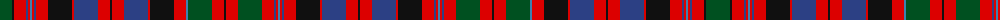

The parent of this is [Unidentified #38](/tartans/g/24/k2/r12/b2/r2/ba2/r2/b2/r12/k24/r2/b24/r12/k2/r12/b24/r2/k24/r12/ba2/g24/r12/k2/r12/g24/r12/b2/r2/ba2/r2/b2/r12/k24/r2/b24/r12/k/2/)

This was sourced from register-of-tartans.  It is a [37 stripes tartan](/stripes/stripes37/).

Original link https://www.tartanregister.gov.uk/tartanDetails.aspx?ref=4239

## Thread count
G/24 K2 R12 B2 R2 Ba2 R2 B2 R12 K24 R2 B24 R12 K2 R12 B24 R2 K24 R12 Ba2 G24 R12 K2 R12 G24 R12 B2 R2 Ba2 R2 B2 R12 K24 R2 B24 R12 K/2

## Palette
Each colour and its ΔE from the base-6 reference it is a variant of.

| Colour | Shade | Base | ΔE (OKLab) |
|---|---|---|---|
| B |  `#2C4084` | B  | 0.00 |
| Ba |  `#3C82AF` | B  | 0.20 |
| G |  `#005020` | G  | 0.08 |
| K |  `#101010` | K  | 0.17 |
| R |  `#DC0000` | R  | 0.04 |

ID: /variants/g/24/k2/r12/b2/r2/ba2/r2/b2/r12/k24/r2/b24/r12/k2/r12/b24/r2/k24/r12/ba2/g24/r12/k2/r12/g24/r12/b2/r2/ba2/r2/b2/r12/k24/r2/b24/r12/k/2-b2c4084-ba3c82af-g005020-k101010-rdc0000/
