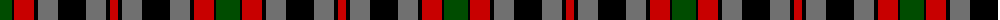

The parent of this is [Borthwick D](/tartans/g/24/k2/r20/k4/n20/k28/n20/k4/r/8/)

This was sourced from weddslist.  It is a [9 stripes tartan](/stripes/stripes9/).

Original link http://www.weddslist.com/cgi-bin/tartans/pg.pl?source=rb

## Thread count
G/24 K2 R20 K4 N20 K28 N20 K4 R/8

## Palette
Each colour and its ΔE from the base-6 reference it is a variant of.

| Colour | Shade | Base | ΔE (OKLab) |
|---|---|---|---|
| G |  `#004C00` | G  | 0.08 |
| K |  `#000000` | K  | 0.00 |
| N |  `#707070` | G  | 0.18 |
| R |  `#C80000` | R  | 0.00 |

ID: /variants/g/24/k2/r20/k4/n20/k28/n20/k4/r/8-g004c00-k000000-n707070-rc80000/
