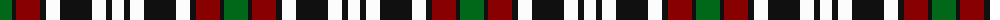

The parent of this is [Borthwick Dress](/tartans/g/24/k4/dr24/k6/w14/k32/w14/k6/w/12/)

This was sourced from register-of-tartans.  It is a [9 stripes tartan](/stripes/stripes9/).

Original link https://www.tartanregister.gov.uk/tartanDetails.aspx?ref=317

## Thread count
G/24 K4 DR24 K6 W14 K32 W14 K6 W/12

## Palette
Each colour and its ΔE from the base-6 reference it is a variant of.

| Colour | Shade | Base | ΔE (OKLab) |
|---|---|---|---|
| DR |  `#880000` | R  | 0.14 |
| G |  `#006818` | G  | 0.02 |
| K |  `#101010` | K  | 0.17 |
| W |  `#FCFCFC` | W  | 0.03 |

ID: /variants/g/24/k4/dr24/k6/w14/k32/w14/k6/w/12-dr880000-g006818-k101010-wfcfcfc/
