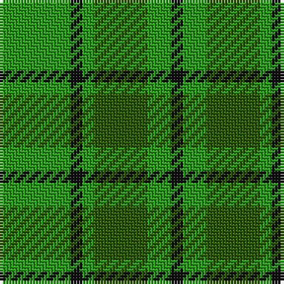

The parent of this is [Campbell-Simpson (Personal)](/tartans/g/24/k4/g4/ga18/g8/k/4/)

This was sourced from tartans-authority.  It is a [6 stripes tartan](/stripes/stripes6/).

Original link http://www.tartansauthority.com/tartan-ferret/display/6125/

## Thread count
G/24 K4 G4 Ga18 G8 K/4

## Palette
Each colour and its ΔE from the base-6 reference it is a variant of.

| Colour | Shade | Base | ΔE (OKLab) |
|---|---|---|---|
| G |  `#289C18` | G  | 0.18 |
| Ga |  `#285800` | G  | 0.04 |
| K |  `#101010` | K  | 0.17 |

# Sample pattern

ID: /variants/g/24/k4/g4/ga18/g8/k/4-g289c18-ga285800-k101010/
