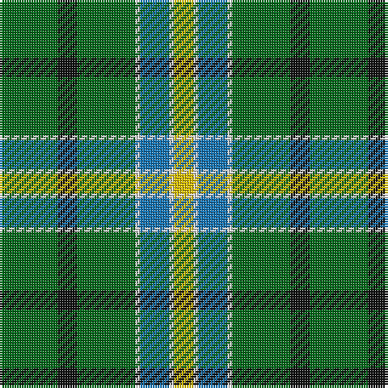

The parent of this is [Pinder, Nigel (Personal)](/tartans/g/24/k8/g24/ln2/b12/ln2/y/8/)

This was sourced from tartans-authority.  It is a [7 stripes tartan](/stripes/stripes7/).

Original link http://www.tartansauthority.com/tartan-ferret/display/8510/

## Thread count
G/24 K8 G24 LN2 B12 LN2 Y/8

## Palette
Each colour and its ΔE from the base-6 reference it is a variant of.

| Colour | Shade | Base | ΔE (OKLab) |
|---|---|---|---|
| B |  `#1474B4` | B  | 0.15 |
| G |  `#006818` | G  | 0.02 |
| K |  `#101010` | K  | 0.17 |
| LN |  `#E0E0E0` | W  | 0.06 |
| Y |  `#E8C000` | Y  | 0.00 |

# Sample pattern

ID: /variants/g/24/k8/g24/ln2/b12/ln2/y/8-b1474b4-g006818-k101010-lne0e0e0-ye8c000/
