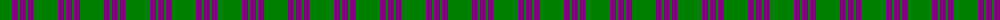
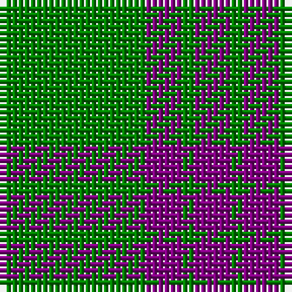

The parent of this is [Elphinstone](/tartans/g/24/p6/g2/p/6/)

This was sourced from weddslist.  It is a [4 stripes tartan](/stripes/stripes4/).

Original link http://www.weddslist.com/cgi-bin/tartans/pg.pl?source=sts

## Thread count
G/24 P6 G2 P/6

## Palette
Each colour and its ΔE from the base-6 reference it is a variant of.

| Colour | Shade | Base | ΔE (OKLab) |
|---|---|---|---|
| G |  `#008000` | G  | 0.09 |
| P |  `#800080` | B  | 0.17 |

# Sample pattern

ID: /variants/g/24/p6/g2/p/6-g008000-p800080/
