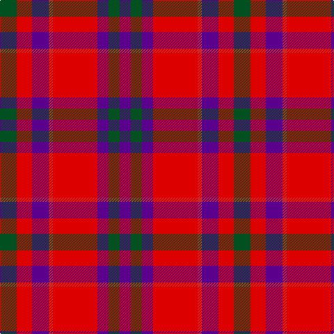

The parent of this is [Fiddes](/tartans/g/24/r22/p24/ra6/r64/p16/g16/p/16/)

This was sourced from register-of-tartans.  It is a [8 stripes tartan](/stripes/stripes8/).

Original link https://www.tartanregister.gov.uk/tartanDetails.aspx?ref=1174

## Thread count
G/24 R22 P24 Ra6 R64 P16 G16 P/16

## Palette
Each colour and its ΔE from the base-6 reference it is a variant of.

| Colour | Shade | Base | ΔE (OKLab) |
|---|---|---|---|
| G |  `#005020` | G  | 0.08 |
| P |  `#5A008C` | B  | 0.12 |
| R |  `#DC0000` | R  | 0.04 |
| Ra |  `#C82828` | R  | 0.03 |

# Sample pattern

ID: /variants/g/24/r22/p24/ra6/r64/p16/g16/p/16-g005020-p5a008c-rdc0000-rac82828/
