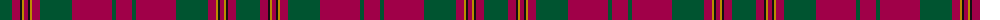

The parent of this is [Livingstone Australia (NSW) (Clan)](/tartans/g/24/r8/k2/dy2/r4/k2/dy2/r8/g32/r40/g4/r/16/)

This was sourced from tartans-authority.  It is a [12 stripes tartan](/stripes/stripes12/).

Original link http://www.tartansauthority.com/tartan-ferret/display/10051/

## Thread count
G/24 R8 K2 DY2 R4 K2 DY2 R8 G32 R40 G4 R/16

## Palette
Each colour and its ΔE from the base-6 reference it is a variant of.

| Colour | Shade | Base | ΔE (OKLab) |
|---|---|---|---|
| DY |  `#BC8C00` | Y  | 0.16 |
| G |  `#005430` | G  | 0.08 |
| K |  `#101010` | K  | 0.17 |
| R |  `#A00048` | R  | 0.11 |

ID: /variants/g/24/r8/k2/dy2/r4/k2/dy2/r8/g32/r40/g4/r/16-dybc8c00-g005430-k101010-ra00048/
