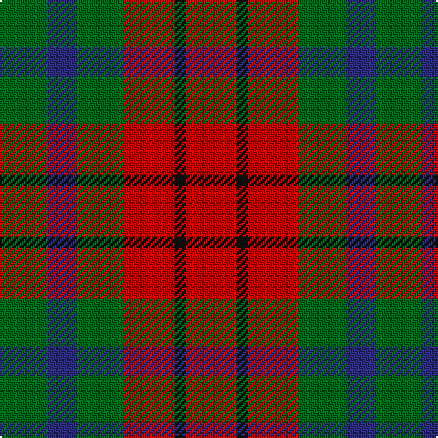

The parent of this is [Tulsa District Tartan Tartan Number: 712. Earliest known date: 1978 The tartan was designed by Richard Crawford, Chinnubbie McIntosh, and Bea Notley, and supported by the Mayor of Tulsa, Robert J. La Fortune who issued a proclamation to 'endorse and ordain the establishment of the Tulsa tartan'. Tulsa is situated on the Arkansas River in Oklahoma, a State much settled by Scots. See products available Copyright © Blair Urquhart, Comrie, 2015](/tartans/g/26/db16/g26/r28/k6/r/28/)

This was sourced from house-of-tartan.  It is a [6 stripes tartan](/stripes/stripes6/).

Original link http://www.house-of-tartan.scotland.net/house/TartanViewjs.asp?colr=Def&tnam=712

## Thread count
G/26 DB16 G26 R28 K6 R/28

## Palette
Each colour and its ΔE from the base-6 reference it is a variant of.

| Colour | Shade | Base | ΔE (OKLab) |
|---|---|---|---|
| DB |  `#2C2C80` | B  | 0.05 |
| G |  `#006818` | G  | 0.02 |
| K |  `#101010` | K  | 0.17 |
| R |  `#C80000` | R  | 0.00 |

# Sample pattern

ID: /variants/g/26/db16/g26/r28/k6/r/28-db2c2c80-g006818-k101010-rc80000/
