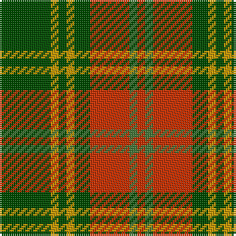

The parent of this is [Oakwood](/tartans/g/26/dy4/g4/dy4/g8/r20/ga4/r/4/)

This was sourced from register-of-tartans.  It is a [8 stripes tartan](/stripes/stripes8/).

Original link https://www.tartanregister.gov.uk/tartanDetails.aspx?ref=3210

## Thread count
G/26 DY4 G4 DY4 G8 R20 Ga4 R/4

## Palette
Each colour and its ΔE from the base-6 reference it is a variant of.

| Colour | Shade | Base | ΔE (OKLab) |
|---|---|---|---|
| DY |  `#C89800` | Y  | 0.12 |
| G |  `#004C00` | G  | 0.08 |
| Ga |  `#48783C` | G  | 0.10 |
| R |  `#C83000` | R  | 0.04 |

# Sample pattern

ID: /variants/g/26/dy4/g4/dy4/g8/r20/ga4/r/4-dyc89800-g004c00-ga48783c-rc83000/
