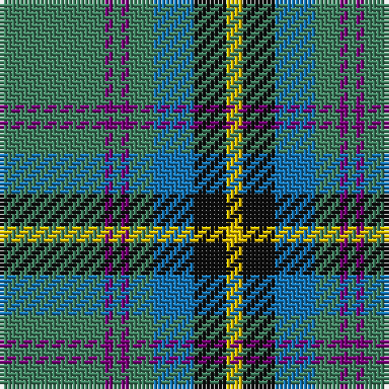

The parent of this is [Carrick Hunting (Personal)](/tartans/g/26/p2/g2/p2/g6/b10/k8/y/4/)

This was sourced from register-of-tartans.  It is a [8 stripes tartan](/stripes/stripes8/).

Original link https://www.tartanregister.gov.uk/tartanDetails.aspx?ref=577

## Thread count
G/26 P2 G2 P2 G6 B10 K8 Y/4

## Palette
Each colour and its ΔE from the base-6 reference it is a variant of.

| Colour | Shade | Base | ΔE (OKLab) |
|---|---|---|---|
| B |  `#1474B4` | B  | 0.15 |
| G |  `#408060` | G  | 0.13 |
| K |  `#101010` | K  | 0.17 |
| P |  `#780078` | B  | 0.16 |
| Y |  `#E8C000` | Y  | 0.00 |

# Sample pattern

ID: /variants/g/26/p2/g2/p2/g6/b10/k8/y/4-b1474b4-g408060-k101010-p780078-ye8c000/
