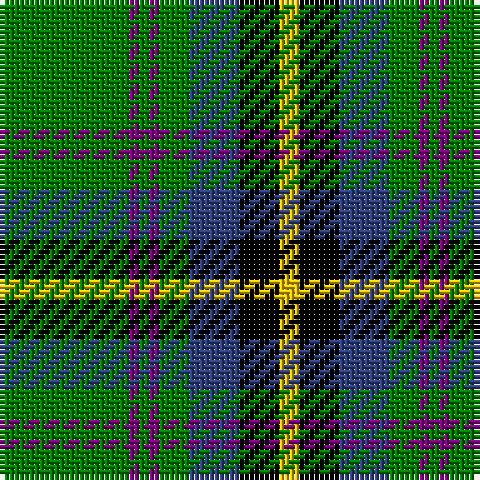

The parent of this is [Carrick, hunting](/tartans/g/26/p2/g2/p2/g6/b10/k8/y/4/)

This was sourced from weddslist.  It is a [8 stripes tartan](/stripes/stripes8/).

Original link http://www.weddslist.com/cgi-bin/tartans/pg.pl?source=sts

## Thread count
G/26 P2 G2 P2 G6 B10 K8 Y/4

## Palette
Each colour and its ΔE from the base-6 reference it is a variant of.

| Colour | Shade | Base | ΔE (OKLab) |
|---|---|---|---|
| B |  `#304080` | B  | 0.01 |
| G |  `#008000` | G  | 0.09 |
| K |  `#000000` | K  | 0.00 |
| P |  `#800080` | B  | 0.17 |
| Y |  `#F0C000` | Y  | 0.01 |

# Sample pattern

ID: /variants/g/26/p2/g2/p2/g6/b10/k8/y/4-b304080-g008000-k000000-p800080-yf0c000/
