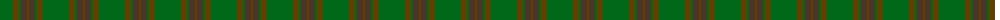
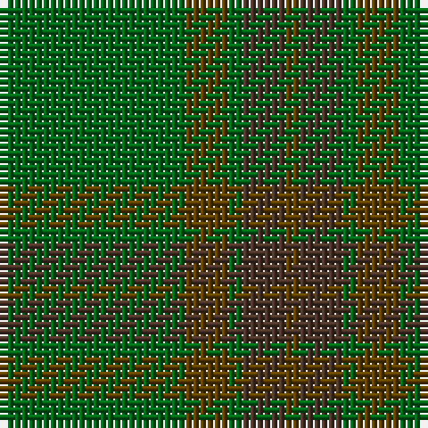

The parent of this is [Glen Boig (Fashion)](/tartans/g/26/ta6/g2/t6/ta/2/)

This was sourced from tartans-authority.  It is a [5 stripes tartan](/stripes/stripes5/).

Original link http://www.tartansauthority.com/tartan-ferret/display/915/

## Thread count
G/26 Ta6 G2 T6 Ta/2

## Palette
Each colour and its ΔE from the base-6 reference it is a variant of.

| Colour | Shade | Base | ΔE (OKLab) |
|---|---|---|---|
| G |  `#006818` | G  | 0.02 |
| T |  `#4C3428` | B  | 0.16 |
| Ta |  `#604000` | G  | 0.14 |

# Sample pattern

ID: /variants/g/26/ta6/g2/t6/ta/2-g006818-t4c3428-ta604000/
