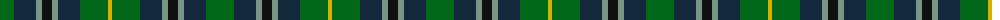

The parent of this is [Wilson's No.122](/tartans/g/28/dn22/lg6/k10/lg6/dn22/g28/y/4/)

This was sourced from register-of-tartans.  It is a [8 stripes tartan](/stripes/stripes8/).

Original link https://www.tartanregister.gov.uk/tartanDetails.aspx?ref=4687

## Thread count
G/28 DN22 LG6 K10 LG6 DN22 G28 Y/4

## Palette
Each colour and its ΔE from the base-6 reference it is a variant of.

| Colour | Shade | Base | ΔE (OKLab) |
|---|---|---|---|
| DG |  `#003820` | G  | 0.16 |
| DN |  `#14283C` | B  | 0.14 |
| G |  `#006818` | G  | 0.02 |
| K |  `#101010` | K  | 0.17 |
| LG |  `#789484` | G  | 0.23 |
| Y |  `#D8B000` | Y  | 0.05 |

# Sample pattern

ID: /variants/g/28/dn22/lg6/k10/lg6/dn22/g28/y/4-dg003820-dn14283c-g006818-k101010-lg789484-yd8b000/
