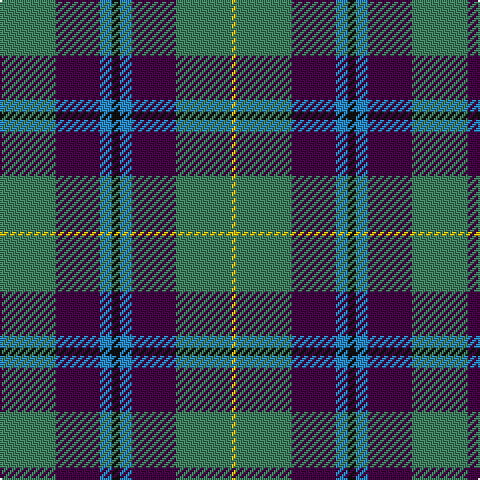

The parent of this is [Wellington (Wilson 122)](/tartans/g/28/dp22/b6/k4/b6/dp22/g28/y/2/)

This was sourced from register-of-tartans.  It is a [8 stripes tartan](/stripes/stripes8/).

Original link https://www.tartanregister.gov.uk/tartanDetails.aspx?ref=4587

## Thread count
G/28 DP22 B6 K4 B6 DP22 G28 Y/2

## Palette
Each colour and its ΔE from the base-6 reference it is a variant of.

| Colour | Shade | Base | ΔE (OKLab) |
|---|---|---|---|
| B |  `#2888C4` | B  | 0.21 |
| DG |  `#003820` | G  | 0.16 |
| DP |  `#440044` | B  | 0.17 |
| G |  `#408060` | G  | 0.13 |
| Ga |  `#006818` | G  | 0.02 |
| K |  `#101010` | K  | 0.17 |
| P |  `#780078` | B  | 0.16 |
| Y |  `#E8C000` | Y  | 0.00 |

# Sample pattern

ID: /variants/g/28/dp22/b6/k4/b6/dp22/g28/y/2-b2888c4-dg003820-dp440044-g408060-ga006818-k101010-p780078-ye8c000/
