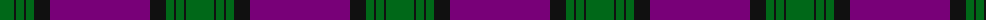
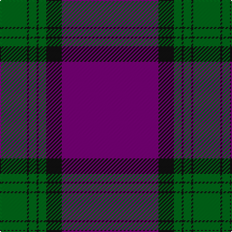

The parent of this is [Ahmlaigh (Corporate)](/tartans/g/28/k2/g8/k2/g8/k16/p/100/)

This was sourced from tartans-authority.  It is a [7 stripes tartan](/stripes/stripes7/).

Original link http://www.tartansauthority.com/tartan-ferret/display/8049/

## Thread count
G/28 K2 G8 K2 G8 K16 P/100

## Palette
Each colour and its ΔE from the base-6 reference it is a variant of.

| Colour | Shade | Base | ΔE (OKLab) |
|---|---|---|---|
| G |  `#006818` | G  | 0.02 |
| K |  `#101010` | K  | 0.17 |
| P |  `#780078` | B  | 0.16 |

# Sample pattern

ID: /variants/g/28/k2/g8/k2/g8/k16/p/100-g006818-k101010-p780078/
