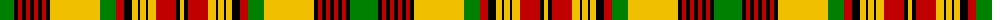

The parent of this is [New Brunswick](/tartans/g/28/k4/r4/k4/r4/k4/r4/k4/r4/k4/y50/g16/r8/k8/y6/k2/y6/k2/y8/r20/k4/y/4/)

This was sourced from weddslist.  It is a [22 stripes tartan](/stripes/stripes22/).

Original link http://www.weddslist.com/cgi-bin/tartans/pg.pl?source=sts

## Thread count
G/28 K4 R4 K4 R4 K4 R4 K4 R4 K4 Y50 G16 R8 K8 Y6 K2 Y6 K2 Y8 R20 K4 Y/4

## Palette
Each colour and its ΔE from the base-6 reference it is a variant of.

| Colour | Shade | Base | ΔE (OKLab) |
|---|---|---|---|
| G |  `#008000` | G  | 0.09 |
| K |  `#000000` | K  | 0.00 |
| R |  `#C00000` | R  | 0.02 |
| Y |  `#F0C000` | Y  | 0.01 |

ID: /variants/g/28/k4/r4/k4/r4/k4/r4/k4/r4/k4/y50/g16/r8/k8/y6/k2/y6/k2/y8/r20/k4/y/4-g008000-k000000-rc00000-yf0c000/
