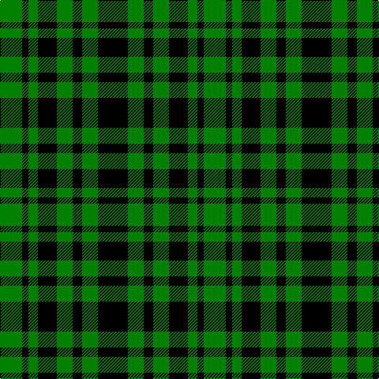

The parent of this is [Menzies, Green](/tartans/g/28/k8/g12/k24/g20/k12/g20/k/38/)

This was sourced from weddslist.  It is a [8 stripes tartan](/stripes/stripes8/).

Original link http://www.weddslist.com/cgi-bin/tartans/pg.pl?source=sts

## Thread count
G/28 K8 G12 K24 G20 K12 G20 K/38

## Palette
Each colour and its ΔE from the base-6 reference it is a variant of.

| Colour | Shade | Base | ΔE (OKLab) |
|---|---|---|---|
| G |  `#008000` | G  | 0.09 |
| K |  `#000000` | K  | 0.00 |

# Sample pattern

ID: /variants/g/28/k8/g12/k24/g20/k12/g20/k/38-g008000-k000000/
