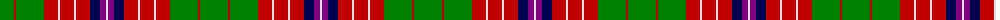

The parent of this is [Hynde](/tartans/g/28/r2/g28/r14/ln2/r14/ln2/r14/db10/p6/ln/2/)

This was sourced from weddslist.  It is a [11 stripes tartan](/stripes/stripes11/).

Original link http://www.weddslist.com/cgi-bin/tartans/pg.pl?source=sts

## Thread count
G/28 R2 G28 R14 LN2 R14 LN2 R14 DB10 P6 LN/2

## Palette
Each colour and its ΔE from the base-6 reference it is a variant of.

| Colour | Shade | Base | ΔE (OKLab) |
|---|---|---|---|
| DB |  `#000050` | B  | 0.20 |
| G |  `#008000` | G  | 0.09 |
| LN |  `#E0E0E0` | W  | 0.06 |
| P |  `#800080` | B  | 0.17 |
| R |  `#C00000` | R  | 0.02 |

ID: /variants/g/28/r2/g28/r14/ln2/r14/ln2/r14/db10/p6/ln/2-db000050-g008000-lne0e0e0-p800080-rc00000/
