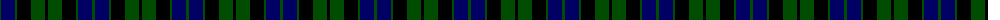
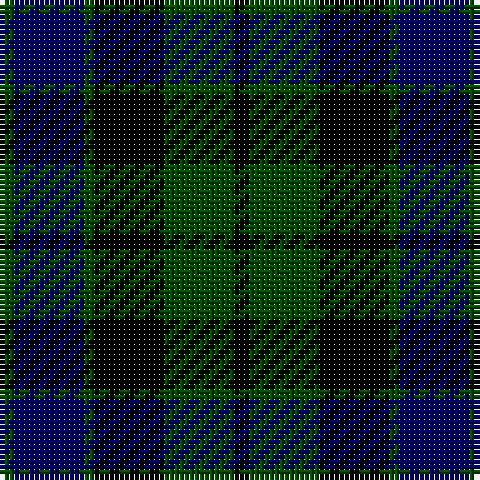

The parent of this is [MacKay](/tartans/g/3/db14/g2/k14/g14/k/3/)

This was sourced from weddslist.  It is a [6 stripes tartan](/stripes/stripes6/).

Original link http://www.weddslist.com/cgi-bin/tartans/pg.pl?source=rb

## Thread count
G/3 DB14 G2 K14 G14 K/3

## Palette
Each colour and its ΔE from the base-6 reference it is a variant of.

| Colour | Shade | Base | ΔE (OKLab) |
|---|---|---|---|
| DB |  `#000064` | B  | 0.17 |
| G |  `#004C00` | G  | 0.08 |
| K |  `#000000` | K  | 0.00 |

# Sample pattern

ID: /variants/g/3/db14/g2/k14/g14/k/3-db000064-g004c00-k000000/
