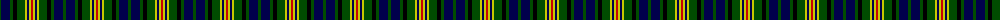

The parent of this is [Maitland](/tartans/g/3/db9/g3/k4/g8/y2/db2/y2/r/2/)

This was sourced from weddslist.  It is a [9 stripes tartan](/stripes/stripes9/).

Original link http://www.weddslist.com/cgi-bin/tartans/pg.pl?source=rb

## Thread count
G/3 DB9 G3 K4 G8 Y2 DB2 Y2 R/2

## Palette
Each colour and its ΔE from the base-6 reference it is a variant of.

| Colour | Shade | Base | ΔE (OKLab) |
|---|---|---|---|
| DB |  `#00004C` | B  | 0.21 |
| G |  `#004C00` | G  | 0.08 |
| K |  `#000000` | K  | 0.00 |
| R |  `#C80000` | R  | 0.00 |
| Y |  `#C8C800` | Y  | 0.05 |

ID: /variants/g/3/db9/g3/k4/g8/y2/db2/y2/r/2-db00004c-g004c00-k000000-rc80000-yc8c800/
