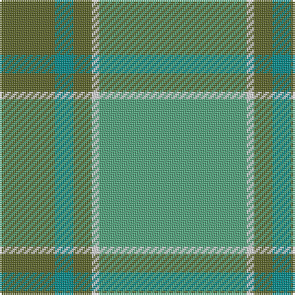

The parent of this is [Castle Bay (Fashion)](/tartans/g/30/b10/g10/ln4/lg/80/)

This was sourced from tartans-authority.  It is a [5 stripes tartan](/stripes/stripes5/).

Original link http://www.tartansauthority.com/tartan-ferret/display/8113/

## Thread count
G/30 B10 G10 LN4 LG/80

## Palette
Each colour and its ΔE from the base-6 reference it is a variant of.

| Colour | Shade | Base | ΔE (OKLab) |
|---|---|---|---|
| B |  `#048888` | G  | 0.18 |
| G |  `#5C6428` | G  | 0.09 |
| LG |  `#50A47C` | G  | 0.23 |
| LN |  `#E0E0E0` | W  | 0.06 |

# Sample pattern

ID: /variants/g/30/b10/g10/ln4/lg/80-b048888-g5c6428-lg50a47c-lne0e0e0/
