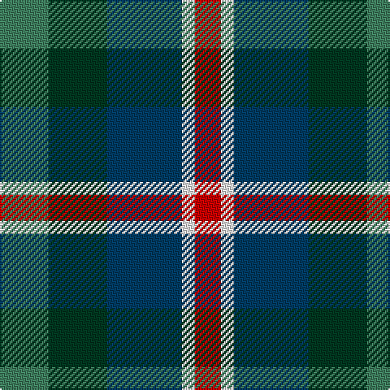

The parent of this is [Friebe (2014)](/tartans/g/30/dg36/db46/w8/r/16/)

This was sourced from tartans-authority.  It is a [5 stripes tartan](/stripes/stripes5/).

Original link http://www.tartansauthority.com/tartan-ferret/display/11171/

## Thread count
G/30 DG36 DB46 W8 R/16

## Palette
Each colour and its ΔE from the base-6 reference it is a variant of.

| Colour | Shade | Base | ΔE (OKLab) |
|---|---|---|---|
| DB |  `#003C64` | B  | 0.07 |
| DG |  `#003820` | G  | 0.16 |
| G |  `#408060` | G  | 0.13 |
| R |  `#C80000` | R  | 0.00 |
| W |  `#FCFCFC` | W  | 0.03 |

# Sample pattern

ID: /variants/g/30/dg36/db46/w8/r/16-db003c64-dg003820-g408060-rc80000-wfcfcfc/
