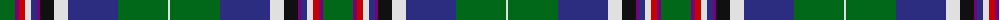

The parent of this is [Brehat Personal Tartan Tartan Number: 7245. Earliest known date: 2006 Renaud Brehat designed this tartan to wear as a kilt to the wedding of his parents. He added these words,"Hearth and sea is where we came from, Briton first, French colours embraced by Scottish colours remembered auld alliance." See products available Copyright © Blair Urquhart, Comrie, 2015](/tartans/g/30/p4/r6/ln6/db6/p3/k14/ln14/db50/g50/ln/2/)

This was sourced from house-of-tartan.  It is a [11 stripes tartan](/stripes/stripes11/).

Original link http://www.house-of-tartan.scotland.net/house/TartanViewjs.asp?colr=Def&tnam=7245

## Thread count
G/30 P4 R6 LN6 DB6 P3 K14 LN14 DB50 G50 LN/2

## Palette
Each colour and its ΔE from the base-6 reference it is a variant of.

| Colour | Shade | Base | ΔE (OKLab) |
|---|---|---|---|
| DB |  `#2C2C80` | B  | 0.05 |
| G |  `#006818` | G  | 0.02 |
| K |  `#101010` | K  | 0.17 |
| LN |  `#E0E0E0` | W  | 0.06 |
| P |  `#780078` | B  | 0.16 |
| R |  `#C80000` | R  | 0.00 |

ID: /variants/g/30/p4/r6/ln6/db6/p3/k14/ln14/db50/g50/ln/2-db2c2c80-g006818-k101010-lne0e0e0-p780078-rc80000/
