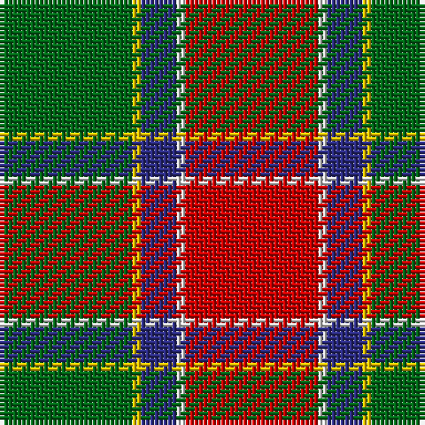

The parent of this is [Eglinton, Duke of (Artefact)](/tartans/g/30/y2/db8/ln2/r/30/)

This was sourced from tartans-authority.  It is a [5 stripes tartan](/stripes/stripes5/).

Original link http://www.tartansauthority.com/tartan-ferret/display/7728/

## Thread count
G/30 Y2 DB8 LN2 R/30

## Palette
Each colour and its ΔE from the base-6 reference it is a variant of.

| Colour | Shade | Base | ΔE (OKLab) |
|---|---|---|---|
| DB |  `#2C2C80` | B  | 0.05 |
| G |  `#006818` | G  | 0.02 |
| LN |  `#E0E0E0` | W  | 0.06 |
| R |  `#C80000` | R  | 0.00 |
| Y |  `#E8C000` | Y  | 0.00 |

# Sample pattern

ID: /variants/g/30/y2/db8/ln2/r/30-db2c2c80-g006818-lne0e0e0-rc80000-ye8c000/
