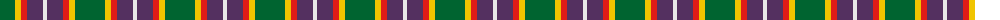
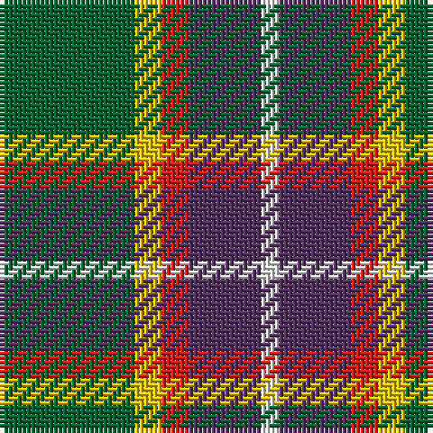

The parent of this is [ChuMac (Personal)](/tartans/g/30/y6/r6/n16/ln/4/)

This was sourced from register-of-tartans.  It is a [5 stripes tartan](/stripes/stripes5/).

Original link https://www.tartanregister.gov.uk/tartanDetails.aspx?ref=10852

## Thread count
G/30 Y6 R6 N16 LN/4

## Palette
Each colour and its ΔE from the base-6 reference it is a variant of.

| Colour | Shade | Base | ΔE (OKLab) |
|---|---|---|---|
| G |  `#006430` | G  | 0.04 |
| LN |  `#E8E8E8` | W  | 0.04 |
| N |  `#543060` | B  | 0.09 |
| R |  `#E01C18` | R  | 0.06 |
| Y |  `#F0C400` | Y  | 0.02 |

# Sample pattern

ID: /variants/g/30/y6/r6/n16/ln/4-g006430-lne8e8e8-n543060-re01c18-yf0c400/
