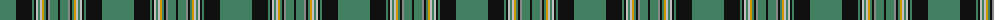

The parent of this is [Savoy (Fashion)](/tartans/g/32/k16/g2/k2/n2/g2/n2/dy2/g2/k2/na2/g8/k/2/)

This was sourced from tartans-authority.  It is a [13 stripes tartan](/stripes/stripes13/).

Original link http://www.tartansauthority.com/tartan-ferret/display/5383/

## Thread count
G/32 K16 G2 K2 N2 G2 N2 DY2 G2 K2 Na2 G8 K/2

## Palette
Each colour and its ΔE from the base-6 reference it is a variant of.

| Colour | Shade | Base | ΔE (OKLab) |
|---|---|---|---|
| DY |  `#D09800` | Y  | 0.11 |
| G |  `#408060` | G  | 0.13 |
| K |  `#101010` | K  | 0.17 |
| N |  `#C0C0C0` | W  | 0.16 |
| Na |  `#888888` | R  | 0.24 |

ID: /variants/g/32/k16/g2/k2/n2/g2/n2/dy2/g2/k2/na2/g8/k/2-dyd09800-g408060-k101010-nc0c0c0-na888888/
