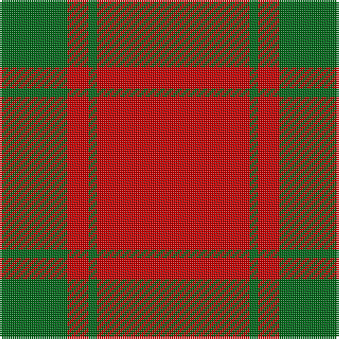

The parent of this is [MacDonald of Sleat Clan Tartan Tartan Number: 904. Earliest known date: 1908 The MacDonald of Sleat tartan was manufactured in the 18th century and called MacDonald of Sleat, Lord of the Isles. The pattern was devised from an old MacDonald tartan that is shown in a painting at Armadale Castle, but it appears that the reconstruction differs somewhat from the original. Whether this was intended or simply a mistake is entirely open to conjecture but it would not be the first new design to have arisen from an error in the threadcount. The first recorded publication of the sett can be found in Adam's work of 1908. See products available Copyright © Blair Urquhart, Comrie, 2015](/tartans/g/32/r10/g4/r/72/)

This was sourced from house-of-tartan.  It is a [4 stripes tartan](/stripes/stripes4/).

Original link http://www.house-of-tartan.scotland.net/house/TartanViewjs.asp?colr=Def&tnam=904

## Thread count
G/32 R10 G4 R/72

## Palette
Each colour and its ΔE from the base-6 reference it is a variant of.

| Colour | Shade | Base | ΔE (OKLab) |
|---|---|---|---|
| G |  `#006818` | G  | 0.02 |
| R |  `#C80000` | R  | 0.00 |

# Sample pattern

ID: /variants/g/32/r10/g4/r/72-g006818-rc80000/
