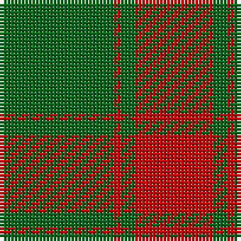

The parent of this is [Middleton Family Tartan Tartan Number: 903. Earliest known date: 1906 Sir Thomas Middleton of Rosefarm in Cromarty was a distinguished agriculturalist in the Department of Food Production during the First World War. Middletons are associated with the Forbes and the Innes Clans. See products available Copyright © Blair Urquhart, Comrie, 2015](/tartans/g/32/r2/g4/r/22/)

This was sourced from house-of-tartan.  It is a [4 stripes tartan](/stripes/stripes4/).

Original link http://www.house-of-tartan.scotland.net/house/TartanViewjs.asp?colr=Def&tnam=903

## Thread count
G/32 R2 G4 R/22

## Palette
Each colour and its ΔE from the base-6 reference it is a variant of.

| Colour | Shade | Base | ΔE (OKLab) |
|---|---|---|---|
| G |  `#006818` | G  | 0.02 |
| R |  `#C80000` | R  | 0.00 |

# Sample pattern

ID: /variants/g/32/r2/g4/r/22-g006818-rc80000/
