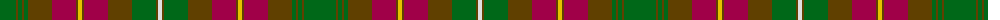

The parent of this is [Prince Edward Island District Tartan Tartan Number: 918. Earliest known date: 1964 The warmth and glow of the fertile soil, The green field and tree, The yellow and the brown of Autumn, The white of surf or a summer snow, Rust, green, yellow and white, Yes! That's our Island Tartan. See products available Copyright © Blair Urquhart, Comrie, 2015](/tartans/g/32/t2/g4/t2/g4/t24/r24/t2/y4/t2/r24/t24/g24/t2/ln/4/)

This was sourced from house-of-tartan.  It is a [15 stripes tartan](/stripes/stripes15/).

Original link http://www.house-of-tartan.scotland.net/house/TartanViewjs.asp?colr=Def&tnam=918

## Thread count
G/32 T2 G4 T2 G4 T24 R24 T2 Y4 T2 R24 T24 G24 T2 LN/4

## Palette
Each colour and its ΔE from the base-6 reference it is a variant of.

| Colour | Shade | Base | ΔE (OKLab) |
|---|---|---|---|
| G |  `#006818` | G  | 0.02 |
| LN |  `#E0E0E0` | W  | 0.06 |
| R |  `#A00048` | R  | 0.11 |
| T |  `#604000` | G  | 0.14 |
| Y |  `#E8C000` | Y  | 0.00 |

ID: /variants/g/32/t2/g4/t2/g4/t24/r24/t2/y4/t2/r24/t24/g24/t2/ln/4-g006818-lne0e0e0-ra00048-t604000-ye8c000/
