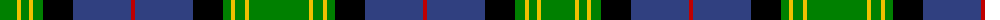

The parent of this is [Unidentified, B'gowrie](/tartans/g/34/y4/g8/y4/g10/k30/b58/r4/b58/k30/g8/y4/g10/y4/g/60/)

This was sourced from weddslist.  It is a [15 stripes tartan](/stripes/stripes15/).

Original link http://www.weddslist.com/cgi-bin/tartans/pg.pl?source=sts

## Thread count
G/34 Y4 G8 Y4 G10 K30 B58 R4 B58 K30 G8 Y4 G10 Y4 G/60

## Palette
Each colour and its ΔE from the base-6 reference it is a variant of.

| Colour | Shade | Base | ΔE (OKLab) |
|---|---|---|---|
| B |  `#304080` | B  | 0.01 |
| G |  `#008000` | G  | 0.09 |
| K |  `#000000` | K  | 0.00 |
| R |  `#C00000` | R  | 0.02 |
| Y |  `#F0C000` | Y  | 0.01 |

ID: /variants/g/34/y4/g8/y4/g10/k30/b58/r4/b58/k30/g8/y4/g10/y4/g/60-b304080-g008000-k000000-rc00000-yf0c000/
