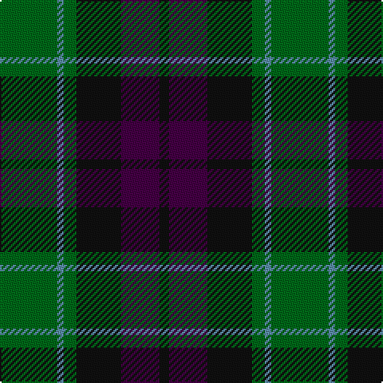

The parent of this is [Coburg (Fashion)](/tartans/g/36/b4/g8/k28/dp24/k/6/)

This was sourced from tartans-authority.  It is a [6 stripes tartan](/stripes/stripes6/).

Original link http://www.tartansauthority.com/tartan-ferret/display/3860/

## Thread count
G/36 B4 G8 K28 DP24 K/6

## Palette
Each colour and its ΔE from the base-6 reference it is a variant of.

| Colour | Shade | Base | ΔE (OKLab) |
|---|---|---|---|
| B |  `#5C8CA8` | B  | 0.23 |
| DP |  `#440044` | B  | 0.17 |
| G |  `#006818` | G  | 0.02 |
| K |  `#101010` | K  | 0.17 |

# Sample pattern

ID: /variants/g/36/b4/g8/k28/dp24/k/6-b5c8ca8-dp440044-g006818-k101010/
