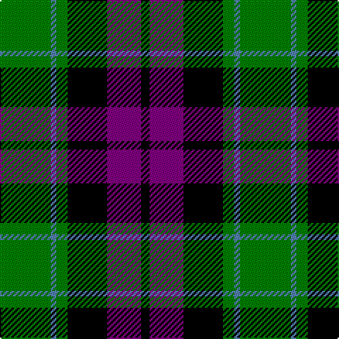

The parent of this is [Wilson's, No 150 "Coburg"](/tartans/g/36/b4/g8/k28/p24/k/6/)

This was sourced from weddslist.  It is a [6 stripes tartan](/stripes/stripes6/).

Original link http://www.weddslist.com/cgi-bin/tartans/pg.pl?source=sts

## Thread count
G/36 B4 G8 K28 P24 K/6

## Palette
Each colour and its ΔE from the base-6 reference it is a variant of.

| Colour | Shade | Base | ΔE (OKLab) |
|---|---|---|---|
| B |  `#5480B0` | B  | 0.20 |
| G |  `#008000` | G  | 0.09 |
| K |  `#000000` | K  | 0.00 |
| P |  `#800080` | B  | 0.17 |

# Sample pattern

ID: /variants/g/36/b4/g8/k28/p24/k/6-b5480b0-g008000-k000000-p800080/
