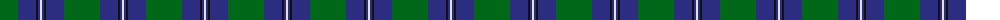
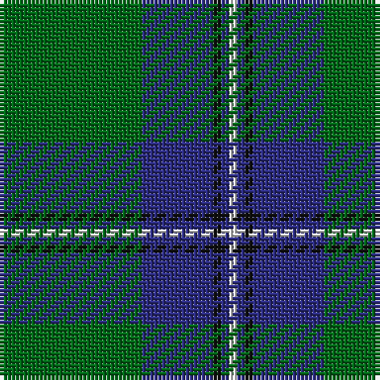

The parent of this is [Irvine Clan Tartan Tartan Number: 733. Earliest known date: c.1889 Scottish Tartans Society notes say that this tartan was 'first made by Peter MacArthur and Co, Hamilton'. MacKinlay, a tartan collector between 1930 and 1950, gives the earliest date as 1889 but it is not known upon what evidence. The name Irvine derives from an old parish name in Dumfries-shire, and from Irvine in Ayrshire. William de Irwyne obtained the forest of Drum in 1324, and is thus the ancestor of the Irvines of Drum. See products available Copyright © Blair Urquhart, Comrie, 2015](/tartans/g/36/db18/k2/db2/ln/2/)

This was sourced from house-of-tartan.  It is a [5 stripes tartan](/stripes/stripes5/).

Original link http://www.house-of-tartan.scotland.net/house/TartanViewjs.asp?colr=Def&tnam=733

## Thread count
G/36 DB18 K2 DB2 LN/2

## Palette
Each colour and its ΔE from the base-6 reference it is a variant of.

| Colour | Shade | Base | ΔE (OKLab) |
|---|---|---|---|
| DB |  `#2C2C80` | B  | 0.05 |
| G |  `#006818` | G  | 0.02 |
| K |  `#101010` | K  | 0.17 |
| LN |  `#E0E0E0` | W  | 0.06 |

# Sample pattern

ID: /variants/g/36/db18/k2/db2/ln/2-db2c2c80-g006818-k101010-lne0e0e0/
