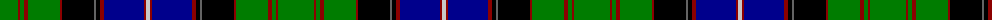

The parent of this is [Canadian Estate](/tartans/g/36/dr2/g4/dr4/g32/dr2/k32/n2/k4/dr4/db40/dr2/na/4/)

This was sourced from register-of-tartans.  It is a [13 stripes tartan](/stripes/stripes13/).

Original link https://www.tartanregister.gov.uk/tartanDetails.aspx?ref=546

## Thread count
G/36 DR2 G4 DR4 G32 DR2 K32 N2 K4 DR4 DB40 DR2 Na/4

## Palette
Each colour and its ΔE from the base-6 reference it is a variant of.

| Colour | Shade | Base | ΔE (OKLab) |
|---|---|---|---|
| DB |  `#00008C` | B  | 0.13 |
| DR |  `#8C0000` | R  | 0.13 |
| G |  `#007C00` | G  | 0.08 |
| K |  `#000000` | K  | 0.00 |
| N |  `#646464` | B  | 0.16 |
| Na |  `#C8C8C8` | W  | 0.13 |

ID: /variants/g/36/dr2/g4/dr4/g32/dr2/k32/n2/k4/dr4/db40/dr2/na/4-db00008c-dr8c0000-g007c00-k000000-n646464-nac8c8c8/
