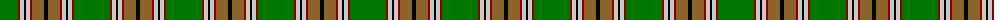
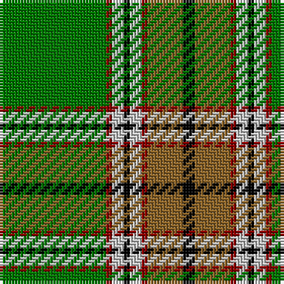

The parent of this is [Humphries (Name)](/tartans/g/36/dr2/n4/k2/n4/dr2/lt12/k/4/)

This was sourced from tartans-authority.  It is a [8 stripes tartan](/stripes/stripes8/).

Original link http://www.tartansauthority.com/tartan-ferret/display/5225/

## Thread count
G/36 DR2 N4 K2 N4 DR2 LT12 K/4

## Palette
Each colour and its ΔE from the base-6 reference it is a variant of.

| Colour | Shade | Base | ΔE (OKLab) |
|---|---|---|---|
| DR |  `#8C0000` | R  | 0.13 |
| G |  `#007800` | G  | 0.06 |
| K |  `#000000` | K  | 0.00 |
| LT |  `#8C6428` | R  | 0.16 |
| N |  `#C8C8C8` | W  | 0.13 |

# Sample pattern

ID: /variants/g/36/dr2/n4/k2/n4/dr2/lt12/k/4-dr8c0000-g007800-k000000-lt8c6428-nc8c8c8/
