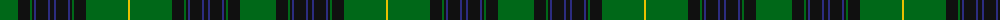

The parent of this is [Grand Lodge of Scotland](/tartans/g/36/k12/g2/k2/db2/k12/db2/k4/db2/k12/db2/k2/g2/k12/g42/y/2/)

This was sourced from register-of-tartans.  It is a [16 stripes tartan](/stripes/stripes16/).

Original link https://www.tartanregister.gov.uk/tartanDetails.aspx?ref=1492

## Thread count
G/36 K12 G2 K2 DB2 K12 DB2 K4 DB2 K12 DB2 K2 G2 K12 G42 Y/2

## Palette
Each colour and its ΔE from the base-6 reference it is a variant of.

| Colour | Shade | Base | ΔE (OKLab) |
|---|---|---|---|
| DB |  `#2C2C80` | B  | 0.05 |
| DG |  `#003820` | G  | 0.16 |
| G |  `#006818` | G  | 0.02 |
| K |  `#101010` | K  | 0.17 |
| Y |  `#E8C000` | Y  | 0.00 |

ID: /variants/g/36/k12/g2/k2/db2/k12/db2/k4/db2/k12/db2/k2/g2/k12/g42/y/2-db2c2c80-dg003820-g006818-k101010-ye8c000/
