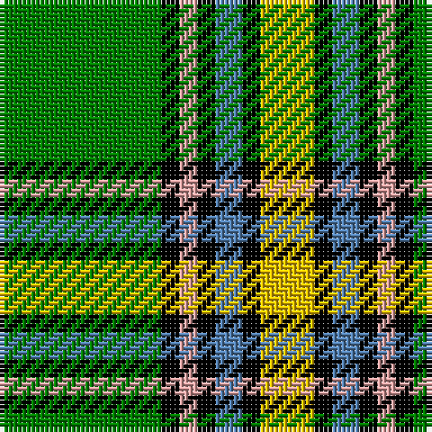

The parent of this is [Alberta](/tartans/g/36/k4/lr4/k4/b6/k4/y/12/)

This was sourced from weddslist.  It is a [7 stripes tartan](/stripes/stripes7/).

Original link http://www.weddslist.com/cgi-bin/tartans/pg.pl?source=sts

## Thread count
G/36 K4 LR4 K4 B6 K4 Y/12

## Palette
Each colour and its ΔE from the base-6 reference it is a variant of.

| Colour | Shade | Base | ΔE (OKLab) |
|---|---|---|---|
| B |  `#5480B0` | B  | 0.20 |
| G |  `#008000` | G  | 0.09 |
| K |  `#000000` | K  | 0.00 |
| LR |  `#E0A0A0` | Y  | 0.17 |
| Y |  `#F0C000` | Y  | 0.01 |

# Sample pattern

ID: /variants/g/36/k4/lr4/k4/b6/k4/y/12-b5480b0-g008000-k000000-lre0a0a0-yf0c000/
