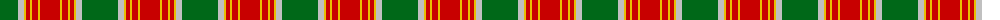
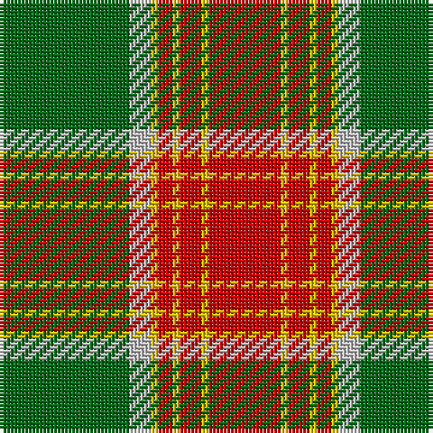

The parent of this is [Brisbane (Artefact)](/tartans/g/36/n6/y2/r4/y2/r6/y2/r/20/)

This was sourced from tartans-authority.  It is a [8 stripes tartan](/stripes/stripes8/).

Original link http://www.tartansauthority.com/tartan-ferret/display/6308/

## Thread count
G/36 N6 Y2 R4 Y2 R6 Y2 R/20

## Palette
Each colour and its ΔE from the base-6 reference it is a variant of.

| Colour | Shade | Base | ΔE (OKLab) |
|---|---|---|---|
| G |  `#006818` | G  | 0.02 |
| N |  `#C0C0C0` | W  | 0.16 |
| R |  `#C80000` | R  | 0.00 |
| Y |  `#E8C000` | Y  | 0.00 |

# Sample pattern

ID: /variants/g/36/n6/y2/r4/y2/r6/y2/r/20-g006818-nc0c0c0-rc80000-ye8c000/
