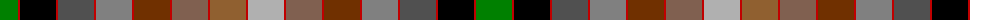

The parent of this is [MacKay of Strathnaver](/tartans/g/36/r2/k36/r2/na36/r2/nb36/r2/t36/r2/lta36/r2/lt36/r2/n36/r2/lta36/r2/t36/r2/nb36/r2/na36/r2/k36/r2/g/36/)

This was sourced from weddslist.  It is a [27 stripes tartan](/stripes/stripes27/).

Original link http://www.weddslist.com/cgi-bin/tartans/pg.pl?source=sts

## Thread count
G/36 R2 K36 R2 Na36 R2 Nb36 R2 T36 R2 LTa36 R2 LT36 R2 N36 R2 LTa36 R2 T36 R2 Nb36 R2 Na36 R2 K36 R2 G/36

## Palette
Each colour and its ΔE from the base-6 reference it is a variant of.

| Colour | Shade | Base | ΔE (OKLab) |
|---|---|---|---|
| G |  `#008000` | G  | 0.09 |
| K |  `#000000` | K  | 0.00 |
| LT |  `#906030` | R  | 0.15 |
| LTa |  `#806050` | R  | 0.17 |
| N |  `#B0B0B0` | Y  | 0.18 |
| Na |  `#505050` | B  | 0.12 |
| Nb |  `#808080` | G  | 0.22 |
| R |  `#C00000` | R  | 0.02 |
| T |  `#703000` | R  | 0.18 |

ID: /variants/g/36/r2/k36/r2/na36/r2/nb36/r2/t36/r2/lta36/r2/lt36/r2/n36/r2/lta36/r2/t36/r2/nb36/r2/na36/r2/k36/r2/g/36-g008000-k000000-lt906030-lta806050-nb0b0b0-na505050-nb808080-rc00000-t703000/
