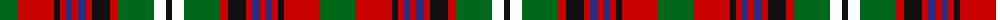

The parent of this is [Maguire](/tartans/g/36/r36/k6/r6/db6/r6/db8/r6/k18/r8/g36/w12/k/6/)

This was sourced from register-of-tartans.  It is a [13 stripes tartan](/stripes/stripes13/).

Original link https://www.tartanregister.gov.uk/tartanDetails.aspx?ref=2784

## Thread count
G/36 R36 K6 R6 DB6 R6 DB8 R6 K18 R8 G36 W12 K/6

## Palette
Each colour and its ΔE from the base-6 reference it is a variant of.

| Colour | Shade | Base | ΔE (OKLab) |
|---|---|---|---|
| DB |  `#2C2C80` | B  | 0.05 |
| G |  `#006818` | G  | 0.02 |
| K |  `#101010` | K  | 0.17 |
| R |  `#C80000` | R  | 0.00 |
| W |  `#FCFCFC` | W  | 0.03 |

ID: /variants/g/36/r36/k6/r6/db6/r6/db8/r6/k18/r8/g36/w12/k/6-db2c2c80-g006818-k101010-rc80000-wfcfcfc/
