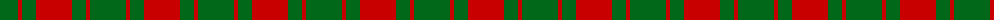

The parent of this is [Applecross (MacDonald) District Tartan Tartan Number: 961. Earliest known date: pre 1947 Named after the district in which it was found. See products available Copyright © Blair Urquhart, Comrie, 2015](/tartans/g/36/r4/g14/r/36/)

This was sourced from house-of-tartan.  It is a [4 stripes tartan](/stripes/stripes4/).

Original link http://www.house-of-tartan.scotland.net/house/TartanViewjs.asp?colr=Def&tnam=961

## Thread count
G/36 R4 G14 R/36

## Palette
Each colour and its ΔE from the base-6 reference it is a variant of.

| Colour | Shade | Base | ΔE (OKLab) |
|---|---|---|---|
| G |  `#006818` | G  | 0.02 |
| R |  `#C80000` | R  | 0.00 |

# Sample pattern

ID: /variants/g/36/r4/g14/r/36-g006818-rc80000/
