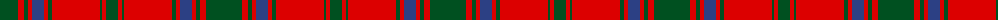

The parent of this is [MacDonell of Glengarry #4](/tartans/g/36/r6/g4/r4/b12/r4/g4/r48/g2/r4/g/12/)

This was sourced from register-of-tartans.  It is a [11 stripes tartan](/stripes/stripes11/).

Original link https://www.tartanregister.gov.uk/tartanDetails.aspx?ref=2383

## Thread count
G/36 R6 G4 R4 B12 R4 G4 R48 G2 R4 G/12

## Palette
Each colour and its ΔE from the base-6 reference it is a variant of.

| Colour | Shade | Base | ΔE (OKLab) |
|---|---|---|---|
| B |  `#2C4084` | B  | 0.00 |
| G |  `#005020` | G  | 0.08 |
| R |  `#DC0000` | R  | 0.04 |

ID: /variants/g/36/r6/g4/r4/b12/r4/g4/r48/g2/r4/g/12-b2c4084-g005020-rdc0000/
