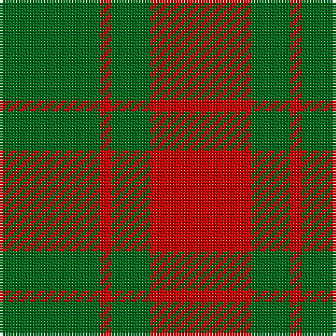

The parent of this is [Applecross](/tartans/g/36/ra4/g14/ra/36/)

This was sourced from register-of-tartans.  It is a [4 stripes tartan](/stripes/stripes4/).

Original link https://www.tartanregister.gov.uk/tartanDetails.aspx?ref=102

## Thread count
G/36 Ra4 G14 Ra/36

## Palette
Each colour and its ΔE from the base-6 reference it is a variant of.

| Colour | Shade | Base | ΔE (OKLab) |
|---|---|---|---|
| G |  `#006818` | G  | 0.02 |
| Ga |  `#408060` | G  | 0.13 |
| Gb |  `#005448` | G  | 0.11 |
| R |  `#C80000` | R  | 0.00 |
| Ra |  `#C80000` | R  | 0.00 |

# Sample pattern

ID: /variants/g/36/ra4/g14/ra/36-g006818-ga408060-gb005448-rc80000-rac80000/
