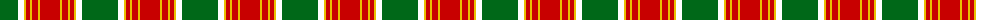
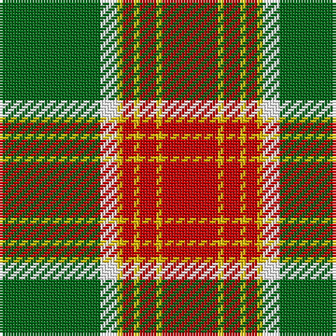

The parent of this is [Brisbane (Artefact)](/tartans/g/36/w6/y2/r4/y2/r6/y2/r/20/)

This was sourced from register-of-tartans.  It is a [8 stripes tartan](/stripes/stripes8/).

Original link https://www.tartanregister.gov.uk/tartanDetails.aspx?ref=355

## Thread count
G/36 W6 Y2 R4 Y2 R6 Y2 R/20

## Palette
Each colour and its ΔE from the base-6 reference it is a variant of.

| Colour | Shade | Base | ΔE (OKLab) |
|---|---|---|---|
| G |  `#006818` | G  | 0.02 |
| R |  `#C80000` | R  | 0.00 |
| W |  `#FFFFFF` | W  | 0.03 |
| Y |  `#E8C000` | Y  | 0.00 |

# Sample pattern

ID: /variants/g/36/w6/y2/r4/y2/r6/y2/r/20-g006818-rc80000-wffffff-ye8c000/
