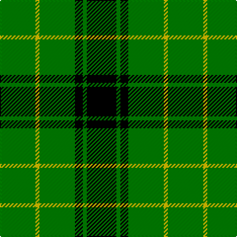

The parent of this is [MacArthur](/tartans/g/36/y4/g36/k8/g4/k/30/)

This was sourced from weddslist.  It is a [6 stripes tartan](/stripes/stripes6/).

Original link http://www.weddslist.com/cgi-bin/tartans/pg.pl?source=sts

## Thread count
G/36 Y4 G36 K8 G4 K/30

## Palette
Each colour and its ΔE from the base-6 reference it is a variant of.

| Colour | Shade | Base | ΔE (OKLab) |
|---|---|---|---|
| G |  `#008000` | G  | 0.09 |
| K |  `#000000` | K  | 0.00 |
| Y |  `#F0C000` | Y  | 0.01 |

# Sample pattern

ID: /variants/g/36/y4/g36/k8/g4/k/30-g008000-k000000-yf0c000/
