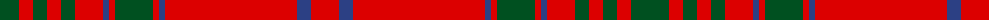

The parent of this is [MacGillivray #3](/tartans/g/38/r14/g14/r14/g14/r28/b6/r6/g38/r6/b6/r132/b14/r/28/)

This was sourced from register-of-tartans.  It is a [14 stripes tartan](/stripes/stripes14/).

Original link https://www.tartanregister.gov.uk/tartanDetails.aspx?ref=2442

## Thread count
G/38 R14 G14 R14 G14 R28 B6 R6 G38 R6 B6 R132 B14 R/28

## Palette
Each colour and its ΔE from the base-6 reference it is a variant of.

| Colour | Shade | Base | ΔE (OKLab) |
|---|---|---|---|
| B |  `#2C4084` | B  | 0.00 |
| G |  `#005020` | G  | 0.08 |
| R |  `#DC0000` | R  | 0.04 |

ID: /variants/g/38/r14/g14/r14/g14/r28/b6/r6/g38/r6/b6/r132/b14/r/28-b2c4084-g005020-rdc0000/
