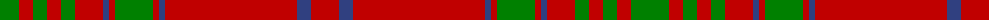

The parent of this is [MacGillivray](/tartans/g/38/r14/g14/r14/g14/r28/b6/r6/g38/r6/b6/r132/b14/r/28/)

This was sourced from weddslist.  It is a [14 stripes tartan](/stripes/stripes14/).

Original link http://www.weddslist.com/cgi-bin/tartans/pg.pl?source=sts

## Thread count
G/38 R14 G14 R14 G14 R28 B6 R6 G38 R6 B6 R132 B14 R/28

## Palette
Each colour and its ΔE from the base-6 reference it is a variant of.

| Colour | Shade | Base | ΔE (OKLab) |
|---|---|---|---|
| B |  `#304080` | B  | 0.01 |
| G |  `#008000` | G  | 0.09 |
| R |  `#C00000` | R  | 0.02 |

ID: /variants/g/38/r14/g14/r14/g14/r28/b6/r6/g38/r6/b6/r132/b14/r/28-b304080-g008000-rc00000/
