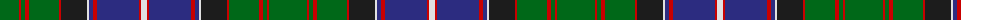

The parent of this is [Ontario (Official)](/tartans/g/38/r2/g4/r4/g30/r2/ka26/ln2/db4/r4/db42/r2/ln/6/)

This was sourced from register-of-tartans.  It is a [13 stripes tartan](/stripes/stripes13/).

Original link https://www.tartanregister.gov.uk/tartanDetails.aspx?ref=3253

## Thread count
G/38 R2 G4 R4 G30 R2 Ka26 LN2 DB4 R4 DB42 R2 LN/6

## Palette
Each colour and its ΔE from the base-6 reference it is a variant of.

| Colour | Shade | Base | ΔE (OKLab) |
|---|---|---|---|
| DB |  `#2C2C80` | B  | 0.05 |
| DG |  `#003820` | G  | 0.16 |
| G |  `#006818` | G  | 0.02 |
| K |  `#101010` | K  | 0.17 |
| Ka |  `#1C1C1C` | B  | 0.20 |
| LN |  `#E0E0E0` | W  | 0.06 |
| R |  `#C80000` | R  | 0.00 |

ID: /variants/g/38/r2/g4/r4/g30/r2/ka26/ln2/db4/r4/db42/r2/ln/6-db2c2c80-dg003820-g006818-k101010-ka1c1c1c-lne0e0e0-rc80000/
