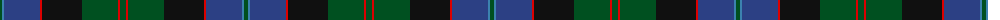
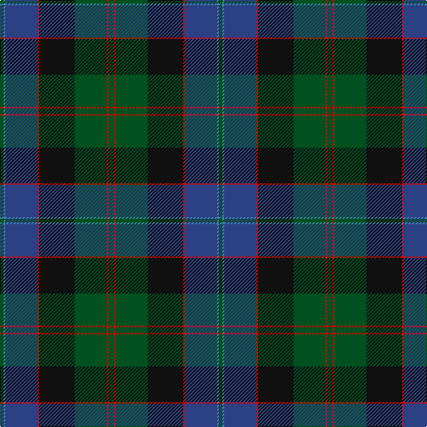

The parent of this is [Lochaber #2](/tartans/g/4/b2/ba36/r2/k40/g36/r2/g/6/)

This was sourced from register-of-tartans.  It is a [8 stripes tartan](/stripes/stripes8/).

Original link https://www.tartanregister.gov.uk/tartanDetails.aspx?ref=2160

## Thread count
G/4 B2 Ba36 R2 K40 G36 R2 G/6

## Palette
Each colour and its ΔE from the base-6 reference it is a variant of.

| Colour | Shade | Base | ΔE (OKLab) |
|---|---|---|---|
| B |  `#3C82AF` | B  | 0.20 |
| Ba |  `#2C4084` | B  | 0.00 |
| G |  `#005020` | G  | 0.08 |
| K |  `#101010` | K  | 0.17 |
| R |  `#DC0000` | R  | 0.04 |

# Sample pattern

ID: /variants/g/4/b2/ba36/r2/k40/g36/r2/g/6-b3c82af-ba2c4084-g005020-k101010-rdc0000/
